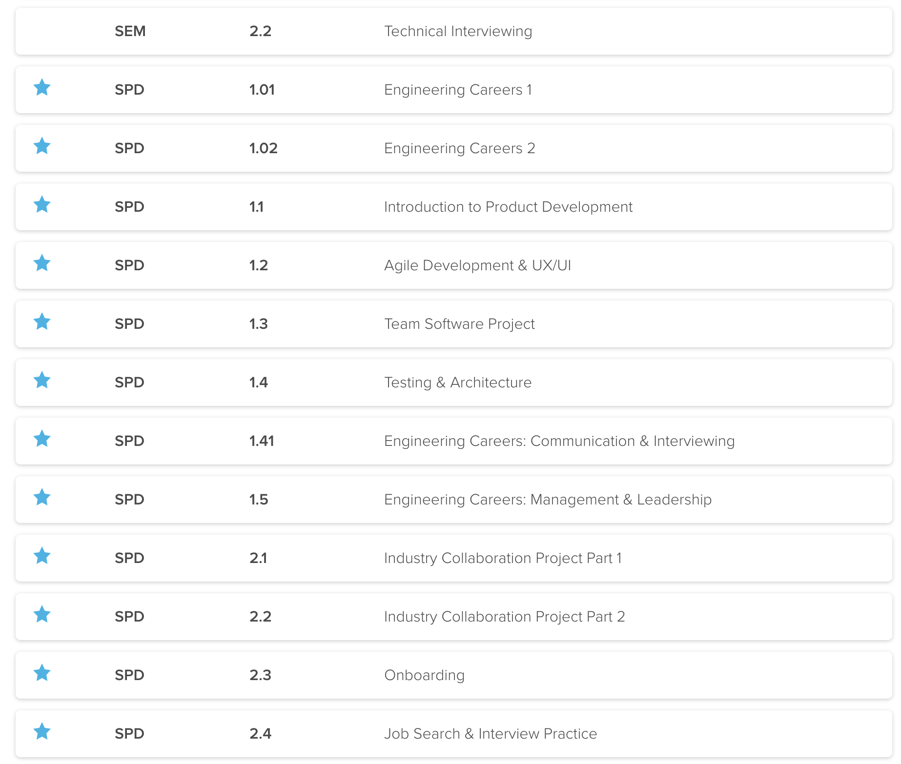

# SPD Course Repo
<!--  -->
<!--  -->

## Author: Chris Barnes

### [Make School Courses - SPD](https://www.makeschool.com/course-offerings)

#### SPD 1.1

- [Course Syllabus](https://make.sc/spd1.1)
- Course Description

    This course covers how to build products that people love. Key concepts include understanding user needs (industry and competitive analysis, user interviews), building iterative prototypes (wireframes, user journeys, scoping), and doing the work to validate your idea (user testing). This course also teaches success skills necessary to become a well-rounded product developer, including using professional communication best practices, building healthy habits, and getting feedback from industry contacts and peers.

#### SPD 1.2

- [Course Syllabus](https://make.sc/spd1.2)
- Course Description

    This course guides students in building a product using the lean product development methodology. Students work in pairs and gain practice working through the challenges that arise during collaboration. This course also layers in lessons related to UI/UX to to help students iteratively improve the look and feel of their product. Key concepts covered include: information hierarchy, system state, grid systems, onboarding teardowns, typography and color, digital mockup tools, user testing. By the end of the term student teams will ship a beautiful product that delights users.

#### SPD 1.3

- [Course Syllabus](https://make.sc/spd1.3)
- Course Description

    This course focuses on the foundational skills of successful engineering teams. Students work in teams of four to conduct weekly sprints and retrospectives. Topics include: SCRUM planning, meeting management, delegation, conflict resolution, role ownership, advanced Git & GitHub, Unix Utilities, performance reviews, basics of organizational psychology and team development. Students utilize all the skills they've developed in SPD thus far to ship a sophisticated multi-feature software product that solves a real world problem.

#### SPD 1.41

- [Course Syllabus](https://make.sc/spd1.41)
- Course Description

    This course focuses on engineering careers, particularly on how to prepare for technical interviews. You'll be able to clearly walk an interviewer through your thought process, clearly craft code on a whiteboard, and check your work to show improvements and drawbacks.

    You will also hone your resume and LinkedIn profiles to highlight your most recent accomplishments. You'll use these stunning upgrades to your resume and portfolio, to connect with industry professionals to hear what their experience was like while interviewing for companies and beginning their careers.

#### SPD 1.5

- [Course Syllabus](https://make.sc/spd1.5)
- Course Description

    This course focuses on engineering careers, particularly on leadership: coaching, leading people and organizations. Students will also focus on solving coding challenges and preparing for technical interviews. Students who perform well in this class will have the option to become peer coaches for incoming students at the start of the new school year.

#### SPD 2.1

- [Course Syllabus](https://make.sc/spd2.1)
- Course Description

    Students team up to work on an ambitious project of their choice or with actual organizations or other student teams to co-develop software products. This experience simulates many challenges and opportunities of actual work environments including, managing stakeholders, cross team collaboration, leading teams, managing up, conflict resolution, advocating for their ideas, increasing probability of adoption within an organization and users. Key concepts of how to lead and how to follow, how to manage and how to be managed are taught through role playing, discussion, and and in depth reading list of both current and classical writings on leadership. For students who never want a job as a manager to those who want to climb the corporate ladder, the course provides vital lessons on how teams work and how to make them great.

#### SPD 2.2

- [Course Syllabus](https://make.sc/spd2.2)
- Course Description

    Students continue work on their industry collaboration project from last term. Now that their products are live, teams will work to acquire and retain users using industry practices in growth marketing. Teams also make data-driven design decisions based off site traffic. This class experience continues to simulates many challenges and opportunities of actual work environments.

#### SPD 2.3

- [Course Syllabus](https://make.sc/spd2.3)
- Course Description

    This course prepares students to onboard to a development job and to navigate the time between joining a company and making valuable contributions to the codebase; commonly known as ramping. Building on best practices from company onboarding programs or Ramp Camps, the course covers common architectures and tools that large codebases use to operate including continuous integration with Travis CI, code reviews, server admin. The course also covers topics one must master to have a successful life as a working professional, such as personal finance, financial models, using spreadsheets, and the science of habit formation, health and wellness.

#### SPD 2.4

- [Course Syllabus](https://make.sc/spd2.4)
- Course Description

    This course offers structured support for the job search. The course starts with a two day workshop to build a well organized and focused application. After the workshop, the course covers choosing the right company, interviewing and negotiation skills. Make School staff work closely with students throughout the process as well as provide connections to startups and companies in our network including HR professionals, alumni, friends at YC companies and tech giants, and more.
